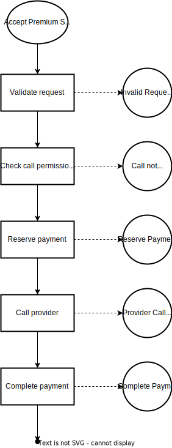

# Premium SMS

A bunch of implementations of a simple premium SMS design.

## Process



## Common data types

Premium SMS request example:

```json
{
  "timestamp": "2024-12-20T10:08:42.123456Z",
  "sender": "614111222333",
  "recipient": "191020",
  "message": "I vote for 5"
}
```

